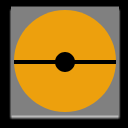

# TCG++
I made this extension because my love for different niches in the Pokemon TCG community, such as Simplified Chinese Cards, Sleeves, Coins, Sealed Items, etc.

## | Features |
- Better Dark Mode
- Simplified Chinese Cards
- Sealed Packs (can add to collection)
- Currency Conversion (dashboard)
- Grid Feature for Binder Management
- TCG++ Account

I'm a big fan of collecting every card and making Master Sets. These new features make it so much easier to collect and add all of our little TCG niches.

## | Planned Features (TO-DO) |
- Sleeve Collecting
- Coin Collecting
- Lots more languages
- More Quality of Life (QoL) features

# Privacy
This extension does NOT take any sensitive TCGCollector data or collection data unless data is affiliated with TCG++ and NEEDS to be saved. The source code is fully published here, and it does not make any changes to existing user data from TCGCollector, only TCG++ data.

### Code Credit
Some of this code comes from an extension for TCGCollector made by Fleker. Shout out to him!
Most of the advanced features were made by me, NicoPlaysThis
